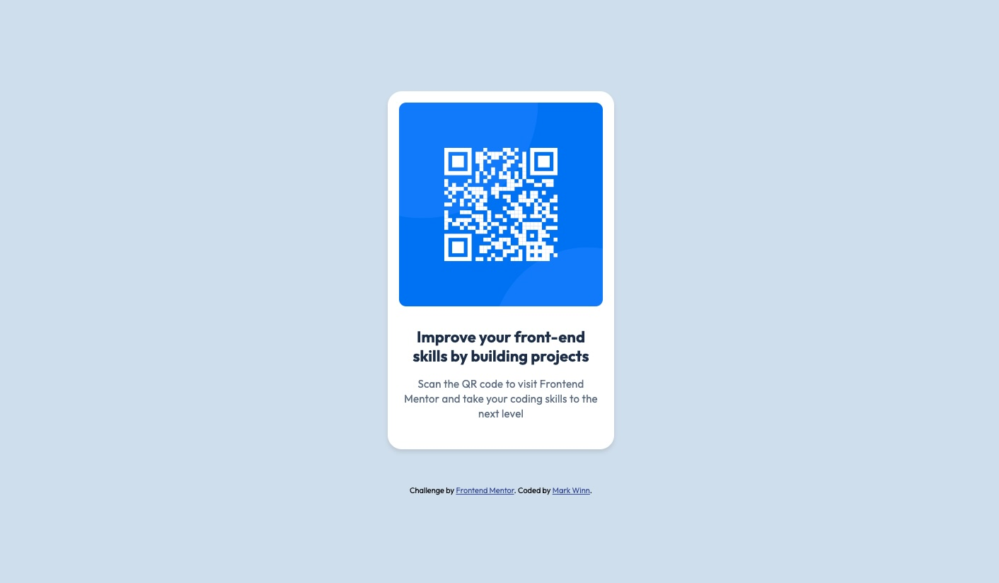

# Frontend Mentor - QR code component solution

This is a solution to the [QR code component challenge on Frontend Mentor](https://www.frontendmentor.io/challenges/qr-code-component-iux_sIO_H). Frontend Mentor challenges help you improve your coding skills by building realistic projects. 

## Table of contents

- [Overview](#overview)
  - [Screenshot](#screenshot)
  - [Links](#links)
- [My process](#my-process)
  - [Built with](#built-with)
  - [What I learned](#what-i-learned)
  - [Continued development](#continued-development)
- [Author](#author)

**Note: Delete this note and update the table of contents based on what sections you keep.**

## Overview

### Screenshot



### Links

- Solution URL: [https://www.frontendmentor.io/solutions/qr-code-project-niVDHECnyZ](https://your-solution-url.com)
- Live Site URL: [https://mwinn616.github.io/QR-Code/](https://your-live-site-url.com)

## My process

### Built with

- Semantic HTML5 markup
- CSS custom properties
- Flexbox
- Mobile-first workflow

### What I learned

In order to style specific bodies of text, I created specific styles in my CSS and then assigned them to the HTML elements accordingly.

Here are some snippets of my code:

```html
<p class="text-center bold">Improve your front-end skills by building projects</p>
<p class="text-center regular">Scan the QR code to visit Frontend Mentor and take your coding skills to the next level</p>
```
```css
.bold {
    font-size: 22px;
    line-height: 120%;
    letter-spacing: 0px;
    font-weight: bold;
    color: var(--slate-900);
}

.regular {
    font-size: 15px;
    line-height: 140%;
    letter-spacing: 0.2px;
    color: var(--slate-500);
}

.text-center {
    text-align: center;
}
```

### Continued development

There are a number of ways to accomplish a project once handed a design brief, but I'd like to learn the most optimal way to code. I'm thinking of future projects where I might iteratie and add to existing code -- I want to ensure I'm setting up the base of the project in a manner that allows for seamless iterations. 


## Author

- Github - [Mark Winn](https://github.com/mwinn616)
- LinkedIn - [@markawinn](https://www.linkedin.com/in/markawinn/)
- Frontend Mentor - [@mwinn616](https://www.frontendmentor.io/profile/mwinn616)